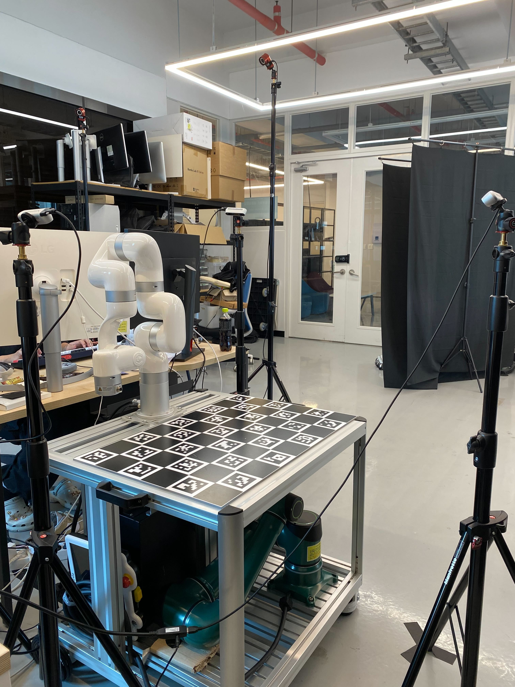
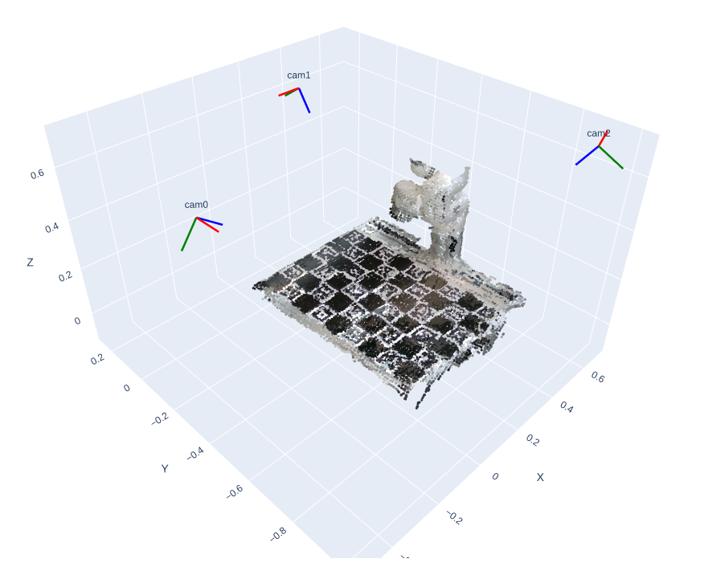
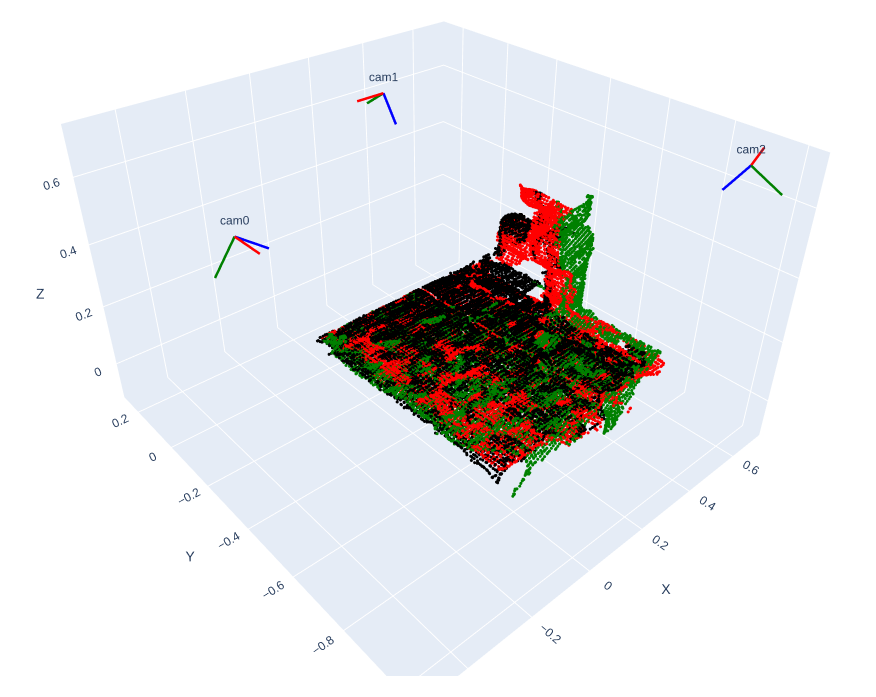
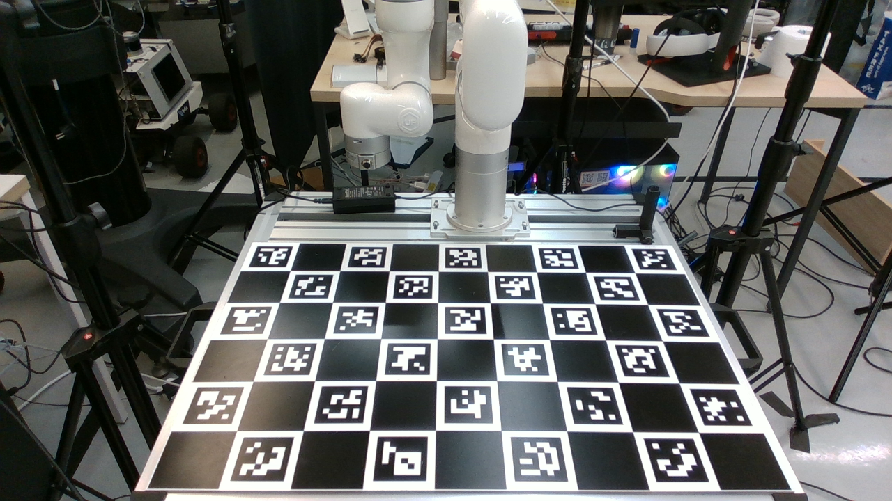
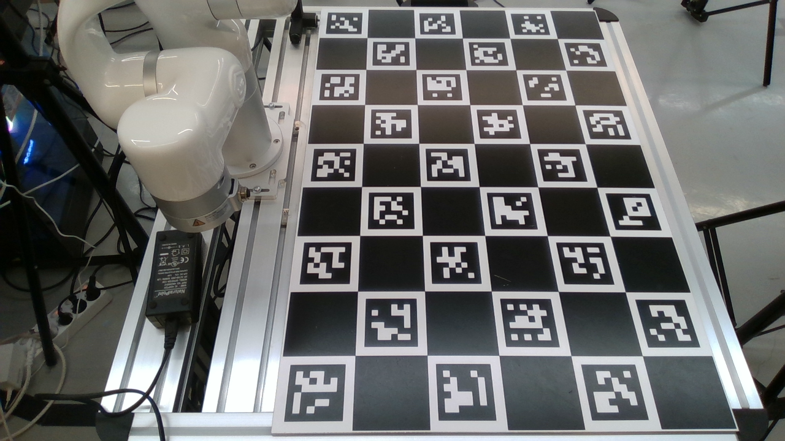
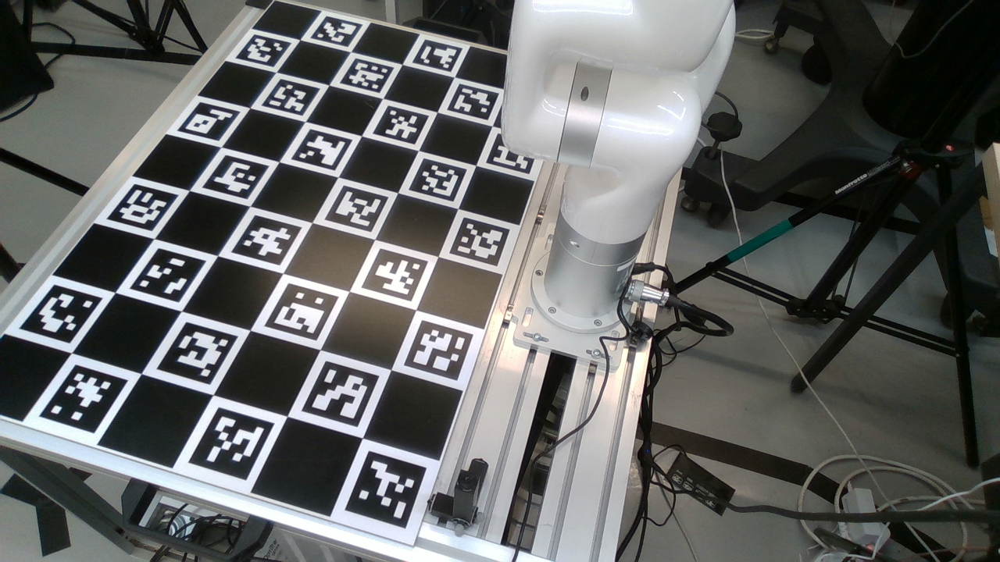

# Multi Camera Extrinsic Calibration

This repository provides a pipeline for performing **multi camera extrinsic calibration**, designed to estimate the rigid body transformation (extrinsics) between cameras.


<p align="center">
  
  
  
</p>


## Prerequisites

### Hardware
* Intel RealSense Cameras
* ChAruco Board (Calibration target)

### Software
**Create the conda environment and install required moduels**:

    
    conda env create -n multi_cam_calib python=3.10.12
    conda activate multi_cam_calib
    pip install -r requirements.txt
    
    
## Data Preparation
To run the calibration pipeline, you must provide both RGB camera data of the calibration target.
To capture the RGB images of the calibration target, run the command below:

```shell
python data_collection.py --config ./config/config.yml
```

We provide a sample dataset captured in a multi-camera environment using three Intel RealSense cameras (located in ./color).


<p align="center">
  
  
  
</p>


## How to Use

### Multi Camera Calibration
You can customize the board's properties (marker size, square size, etc.) and number of cameras in `config.yaml` to fit your needs.

```shell
python calibration.py --config ./config/config.yml
```
